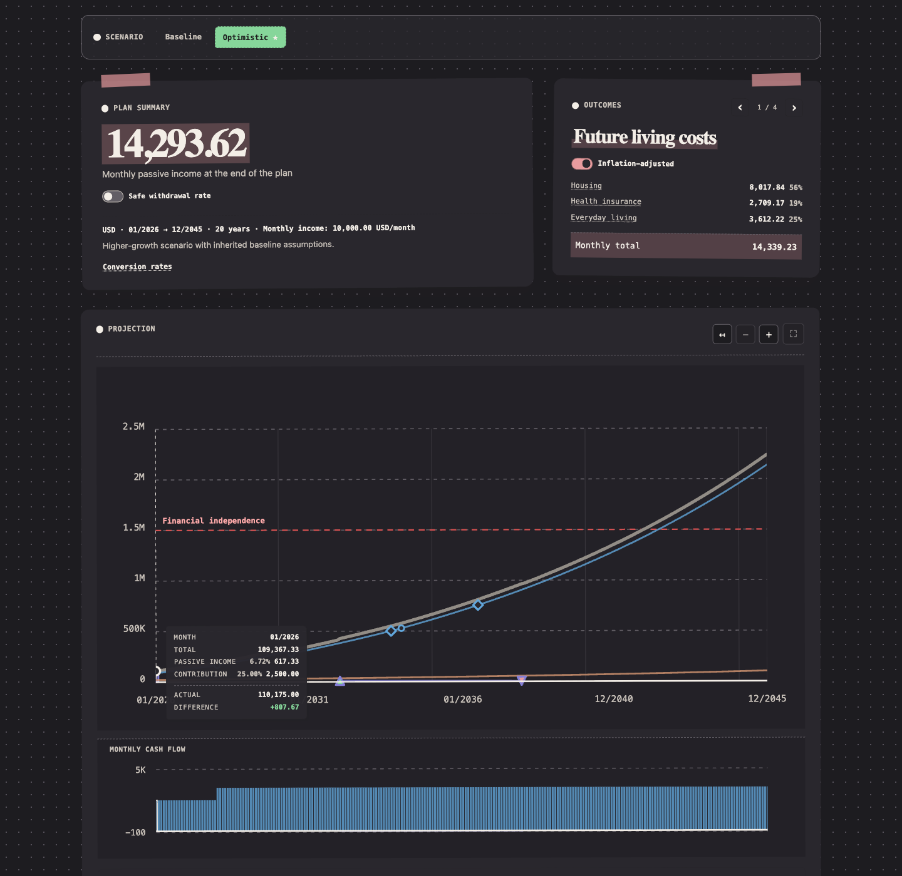

# Everarc

## Your financial future, made visible.

Plan your financial future with your LLM. Explore it in an interactive dashboard.

Everarc is a headless financial planning engine built for LLMs to use, with an
interactive dashboard for you. Tell your LLM what you own, what you save, and
what you're planning for. It can turn that conversation into a plan; Everarc
does the calculations and makes the results visible.

**[Get started](#get-started)** · **[Guide for your LLM](docs/guide.md)**

Your assumptions drive the results. These are projections, not predictions.

*Your LLM builds the plan. Everarc calculates it. You explore the possibilities.*
Screenshot uses [fictional example data](docs/screenshots/example.toml).

## Plan for the life you want

- **Compare possible futures.** What if you save more, retire earlier, or earn
  lower returns? Explore scenarios without duplicating your whole plan.
- **Make room for big expenses.** Schedule a car purchase, recurring costs,
  changes in contributions, or the start of retirement withdrawals.
- **Keep your plan grounded.** Record actual monthly balances and notes so
  future projections start from what you have—not what you hoped to have.
- **See your goals in context.** Model balance targets, retirement living
  costs, and assets in multiple currencies with explicit conversion rates.
- **Own your plan.** Your LLM works with a plain-text configuration, not a
  proprietary format. Everarc calculates locally, with no server to run.

## You explain the life. Your LLM builds the plan.

1. **Tell your LLM what matters.** Your savings, monthly contributions,
   retirement timeline, or a big purchase you're considering.
2. **Let it work with Everarc.** Your LLM can write the configuration and,
   with terminal access, run Everarc to validate and calculate the plan.
3. **Explore and ask “what if?”** Open the dashboard, compare scenarios,
   and ask your LLM to adjust the plan as your questions evolve.

You don't need to learn Everarc's configuration format. The
[guide](docs/guide.md) gives your LLM the reference it needs. Everarc produces
both an interactive HTML dashboard for you and calculated JSON results your
LLM can use—so it doesn't have to invent the numbers.

## Why not let the LLM do everything?

Financial math should be deterministic—not another generated answer.
Given the same configuration, Everarc produces the same calculated results.
Change an assumption, and you can compare its effect without wondering whether
the LLM simply did the math differently.

The LLM helps turn your goals into a plan and explain the results. Everarc
validates the configuration and calculates the projections. **The LLM handles
the conversation; the engine handles the math.**

Deterministic doesn't mean certain: returns, inflation, and future expenses
are still assumptions. Reproducible calculations make those assumptions
explorable, not guaranteed.

## Get started

Give your LLM this repository and the [guide](docs/guide.md). Try a prompt like:

> Help me build a financial plan using Everarc. Read its README and guide,
> help me get it running locally, and ask me about my savings, contributions,
> goals, and assumptions. Build a baseline and a more conservative scenario,
> then generate a dashboard so I can compare them. Use Everarc's calculated
> results when discussing the projections, and confirm assumptions with me
> rather than guessing.

Use an LLM assistant with file and terminal access if you want it to set up
and run Everarc for you. Building from source requires
[Rust](https://rustup.rs/) 1.87 or newer; installation and configuration details
are available in the [guide](docs/guide.md) and
[contributor documentation](CONTRIBUTING.md).

Review the assumptions with your LLM, and check what you're sharing before
uploading a plan or report. You don't need to learn the syntax, but the financial
choices are still yours.

## Privacy

Everarc is written in Rust and calculates projections locally. Your TOML
configuration and generated HTML/JSON reports can contain sensitive balances,
scenario details, and monthly notes—including scenarios not currently selected
in the dashboard. Treat these files as private; review and sanitize them before
sharing, publishing, or uploading them to an LLM service.

The dashboard requests stylesheets and fonts from Google Fonts
(`fonts.googleapis.com` and `fonts.gstatic.com`). Those requests expose your IP
address and browser request metadata to Google, but Everarc does not send your
financial data with them. It is not completely network-independent: when
opened offline or with those requests blocked, it uses fallback fonts.

## Contributing

Want to help improve Everarc? See [CONTRIBUTING.md](CONTRIBUTING.md) for
development commands, pull request expectations, and bug reporting. Report
security vulnerabilities privately as described in [SECURITY.md](SECURITY.md).

## License

Everarc is licensed under the [MIT License](LICENSE).
